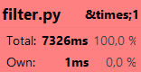
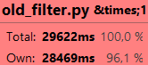
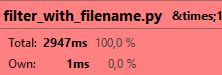
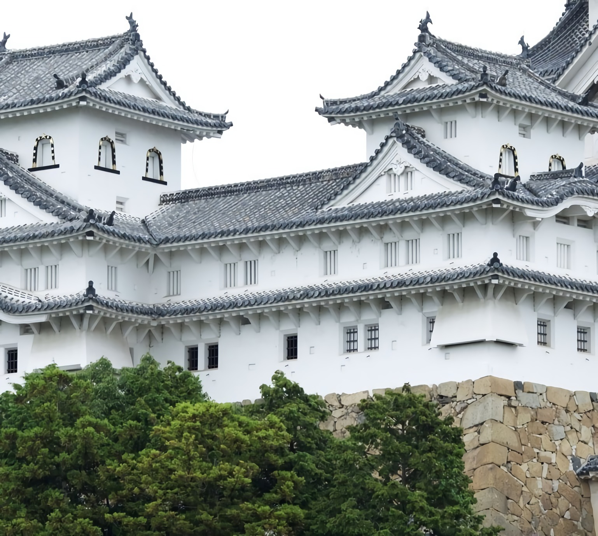
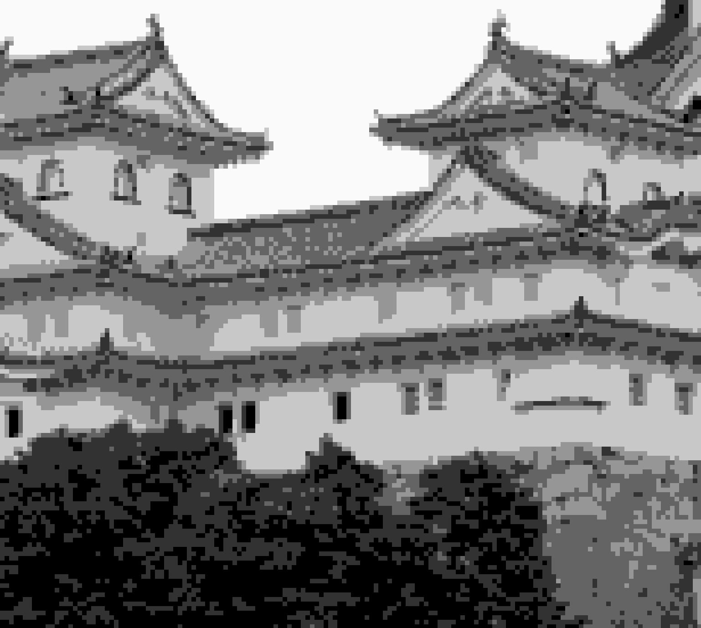
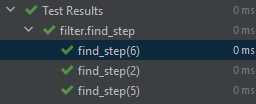
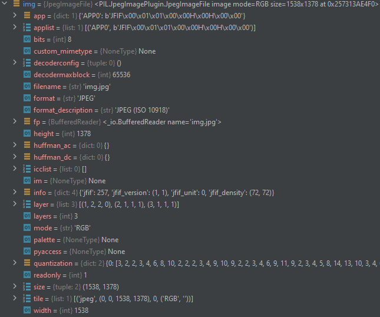

# Task-on-topic-No.-10-PyCharm

____

## Сравнение времени выполнения

Время выполнения filter.py:

Время выполнения old_filter.py:

Разница в общем (total) времени выполнения обусловлена использованием оптимизированных встроенных методов для работы с
матрицами в NumPy, например, average(). Также разница обусловлена использованием срезов вместо циклов. А разница в
собственном (own) времени выполнения обусловлена тем, что ресурсоёмкие задачи в filter.py выделены в отдельные функции.

Время выполнения filter_with_filename.py:

Разница между временем выполнения filter.py и filter_with_filename.py обусловлена отсутствием необходимости ввода
запрашиваемых параметров.

## Изображение до преобразования и после

Исходное изображение:

Результат работы filter.py и filter_with_filename.py:

Результат работы old_filter.py:

## Docstring

Функция работает исправно.

## Debugger

Значения:
+ ширина изображения: 1538;
+ высота изображения: 1378;
+ тип изображения: JPEG;
+ ширины блока: 10;
+ количество градаций серого: 6.